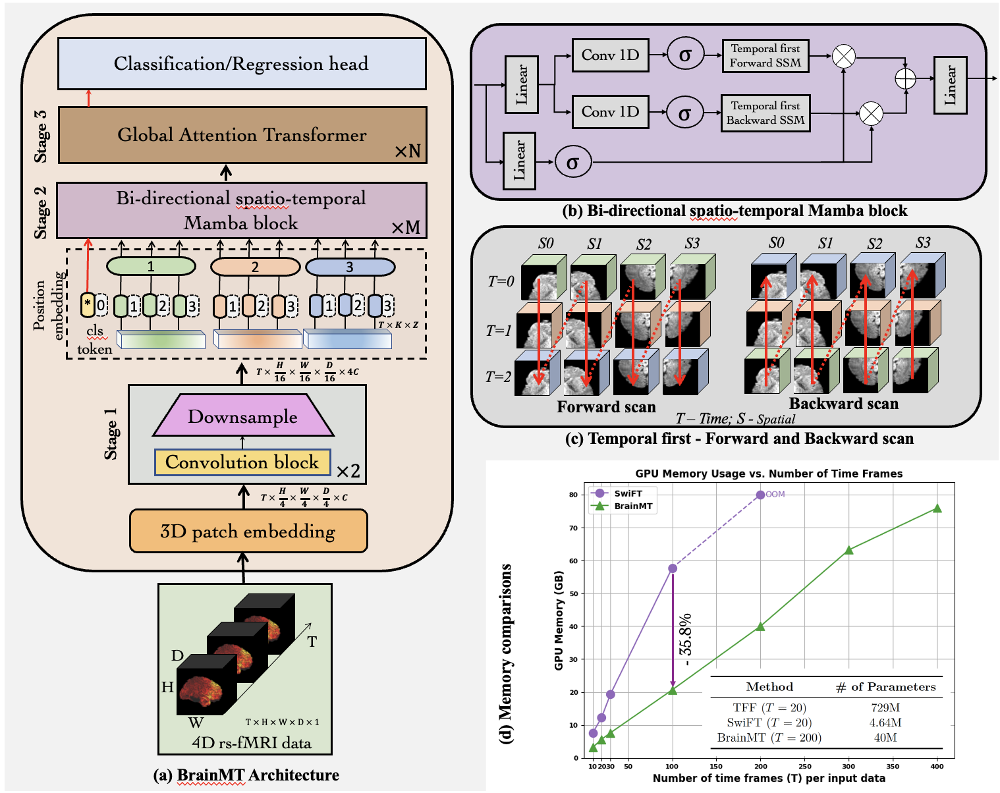

<div align="center">

# BrainMT: A Hybrid Mamba‑Transformer Architecture for Modeling Long‑Range Dependencies in Functional MRI Data

**[Arunkumar Kannan](https://arunkumar-kannan.github.io/), [Martin A. Lindquist](https://sites.google.com/view/martinlindquist/home), [Brian Caffo](https://sites.google.com/view/bcaffo/home)** 

Johns Hopkins University

[](https://arxiv.org/abs/2506.22591)
[](https://github.com/arunkumar-kannan/brainmt-fmri/stargazers)
[](https://visitorbadge.io/status?path=arunkumar-kannan%2Fbrainmt-fmri)
[](https://opensource.org/licenses/MIT)

</div>

🎉 **BrainMT has been accepted to [MICCAI'25](https://conferences.miccai.org/2025/en/)** 🎉

This is an official PyTorch implementation for [BrainMT: A Hybrid Mamba‑Transformer Architecture for Modeling Long‑Range Dependencies in Functional MRI Data](https://papers.miccai.org/miccai-2025/paper/1341_paper.pdf).

Contact: [akannan7@jhu.edu](akannan7@jhu.edu) (Arunkumar Kannan)

Share us a ⭐️ if you find our repository helpful!


## ✨ Highlights

🔍 **Motivation:** Can we develop deep learning models that efficiently operate on voxel-level fMRI data - just like we do with other medical imaging modalities?

🧠 **Architecture:** We introduce BrainMT, a novel hybrid framework designed to efficiently learn and integrate long-range spatiotemporal attributes in fMRI data. BrainMT framework operates in two stages:
  - 1️⃣ A bidirectional Mamba block with a temporal-first scanning mechanism to capture global temporal interactions in a computationally efficient manner; and
  - 2️⃣ A transformer block leveraging self-attention to model global spatial relationships across the deep features processed by the Mamba block.
    
📈 **Results:** Through extensive experiments and ablation studies on two large-scale public datasets - UKBioBank (UKB) and the Human Connectome Project (HCP), we demonstrate that BrainMT outperforms existing methods and generalizes robustly across diverse tasks for improved phenotypic prediction in neuroimaging.

<div align="center">
  
</div>


## Getting Started

This section will guide you through setting up the environment, preprocessing data, and running the BrainMT model.

### 1. Environment Setup

This code is implemented using Python 3.9.18, PyTorch 2.6.0 and CUDA 12.4. 

#### Step 1: Create and activate virtual environment
```bash
# Create virtual environment
python -m venv brainmt_env

# Activate virtual environment
source brainmt_env/bin/activate
```
#### Step 2: Install dependencies
```bash
# Install from requirements.txt
pip install -r requirements.txt
```

### 2. Data Preparation

Our workflow begins with data that has already been processed through the standardized fMRI preprocessing pipelines of the [UK BioBank (UKB)](https://www.ukbiobank.ac.uk) and [Human Connectome Project (HCP)](https://www.humanconnectome.org/study/hcp-young-adult/document/extensively-processed-fmri-data-documentation). The data preparation steps are two-fold here: converting the fMRI volumes into a model-friendly format and preparing the corresponding phenotype targets for our downstream tasks.

#### 🧠 Preprocessing fMRI Volumes
The primary goal here is to convert the NIfTI files into a more efficient format for our model. The preprocessing script, located in `src/brainmt/preprocessing/`, handles the following:
* **Normalization**: Applies voxel-wise normalization across the time dimension (either **z-score** or **min-max**).
* **Masking**: Removes background voxels to reduce computational overhead.
* **Conversion**: Transforms the 4D fMRI volumes into PyTorch tensors and saves them in `fp16` format to significantly reduce storage space and accelerate data loading during training.

##### Usage
1.  **Configure paths and parameters** in `preprocessing/preprocess_fmri.py`.
    * `load_root`: Set this to the directory containing preprocessed fMRI NIfTI files.
    * `save_root`: Set this to the output directory where the processed PyTorch tensors will be stored.
2.  **Run the script**:
    ```bash
    python src/brainmt/preprocessing/preprocess_fmri.py
    ```

#### 🎯 Preparing Target Phenotypes
We also prepare the target data for our two downstream tasks: regression and classification.

* **Regression (Cognitive Intelligence):**
    * For the **UKB** dataset, we use fluid intelligence scores from data-field `20016`.
    * For the **HCP** dataset, we use the age-adjusted cognitive composite score from `CogTotalComp_AgeAdj`.
    * To stabilize model training, we **z-normalize** these scores for each dataset independently.

* **Classification (Sex):**
    * For the **UKB** dataset, we use the sex field `31`.
    * For the **HCP** dataset, we use the corresponding gender field.
    * We encode the labels numerically: `'male'` is mapped to `1` and `'female'` is mapped to `0`.

  The final output for each task is a **pickle file** that contains a dictionary mapping each subject's ID to their corresponding target value. This file is used directly by the data loader during model training.

### 3. Running the Model

We use [Hydra](https://hydra.cc/) to manage configurations, making it easy to customize runs from the command line. The configuration files are located in the `configs/` directory.

#### Configuration Files

* `configs/base.yaml`: The main configuration file. It sets default parameters for the model, dataset, training schedule, optimizer, and logging.
* `configs/model/brain_mt.yaml`: Defines the **BrainMT model architecture**.
* `configs/dataset/fmri.yaml`: Specifies the **dataset paths** and properties
* `configs/task/regression.yaml`: Sets the task to **regression**.
* `configs/task/classification.yaml`: Sets the task to **classification**.

#### Training

The `train.py` script handles the model training process using Distributed Data Parallel (DDP) for efficient multi-GPU training.

**1. Configure Training Run:**
Open `configs/dataset/fmri.yaml` and update the `img_path` and `target_path` to point to preprocessed fMRI data and phenotype files.

**2. Start Training:**
To start a training run, you can use the `torchrun` command. The configuration for the run is controlled by modifying parameters directly on the command line.

**Example: Training for Regression**
```bash
torchrun --nproc_per_node=2 train.py task=regression
```

Checkpoints for the best performing model on the validation set will be saved in the directory specified by `checkpoint.dir` in `configs/base.yaml`.

**Note:** If you encounter NCCL P2P communication issues on multi-GPU systems, prefix the command with `NCCL_P2P_DISABLE=1`:

```bash
NCCL_P2P_DISABLE=1 torchrun --nproc_per_node=2 train.py task=regression
```

#### Inference

Execute `inference.py` script specifying the task and the path to the trained model checkpoint.

**Example: Inference for Regression**
```bash
python inference.py task=regression inference.checkpoint_path=/path/to/your/best_model.pth
```

### 4. Checkpoints

| Datasets        | HCP           | UKB  |
| :-------------: |:-------------:| :-----:|
| Regression (cognitive intelligence)      | Download | Download |
| Classification (sex)     | Download     |   Download |


## ✅ To‑Do List for Code Release

- [x] ~~Create repository~~     
- [x] ~~Installation guide – provide `requirements.txt` / `environment.yml` and setup instructions~~  
- [x] ~~Training scripts – release reproducible training pipeline (`train.py`, configs)~~
- [x] ~~Evaluation scripts – include scripts for validation and test‑set evaluation~~
- [x] ~~Dataset prep – share preprocessing scripts~~
- [x] ~~Config files – upload YAML config templates for different tasks~~
- [ ] Release Model checkpoints

## Citation

If you find this repository useful, please consider citing:
```bash
@inproceedings{KanAru_BrainMT_MICCAI2025,
        author = {Kannan, Arunkumar and Lindquist, Martin A. and Caffo, Brian},
        title = {BrainMT: A Hybrid Mamba-Transformer Architecture for Modeling Long-Range Dependencies in Functional MRI Data},
        booktitle = {International Conference on Medical Image Computing and Computer-Assisted Intervention},
        year = {2025},
        publisher = {Springer Nature Switzerland},
        volume = {LNCS 15971},
        month = {September},
        page = {151 -- 161}
}
```
## Acknowledgements

We would like to thank the following repositories for their great works: [VideoMamba](https://github.com/OpenGVLab/VideoMamba), [MambaVision](https://github.com/NVlabs/MambaVision), [SwiFT](https://github.com/Transconnectome/SwiFT), [TFF](https://github.com/GonyRosenman/TFF).

This work used data from the [Human Connectome Project](https://www.humanconnectome.org/study/hcp-young-adult/document/extensively-processed-fmri-data-documentation), WU-Minn Consortium (PIs David Van Essen and Kamil Ugurbil; NIH grant 1U54 MH091657, funded by the 16 NIH Institutes and Centers supporting the NIH Blueprint for Neuroscience Research and the McDonnell Center for Systems Neuroscience at Washington University), as well as from [UK Biobank](https://www.ukbiobank.ac.uk) (Project ID 33278), a major biomedical database.


